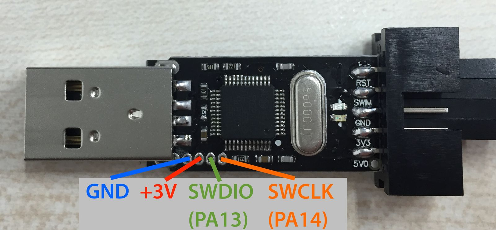

#stlink-v2-toolkit
How to recover (or make from scratch) an stlink v2 board, and a bunch of other tools

Clone and load the submodules in this repo:

     git clone --recursive git@github.com:mike-pittelko/stlink-v2-toolkit.git

or

     git clone git@github.com:mike-pittelko/stlink-v2-toolkit.git

and pull in the submodules you need:

     git submodule update [blackmagic,openocd,stlink,Stlink_V2.1_PCB,Stlink-Bootloaders,atom-stlink]

You need open-ocd and stlink installed:

     brew install open-ocd
     brew install stlink

Mirrors are in this repo as submodules if needed.

Figure out what config file you need...

To setup the config, you MAY need to do this:

if the cpuid "0x2ba01477" is not found (expects 0x1ba01477) when unlocking then you need to
     make a copy of targets/stm32f1x.cfg,
          cp /usr/local/Cellar/open-ocd/0.10.0/share/openocd/scripts/target/stm32f1x.cfg mikep.cfg
     at the top of the file, change to:

     if { [info exists CHIPNAME] } {
        set _CHIPNAME $CHIPNAME
     } else {
        set _CHIPNAME stm32f1x
     }
     set CPUTAPID 0x2ba01477

     save as myconfig.cfg and: CONFIG.CFG = myconfig.cfg
else
	CONFIG.CFG = target/stm32f1x.cfg

Step 1:
Connect an stlinkv2 to the programming pins on the stlinkv2 you want to recover/program (the one being **fixed**). These are ususally located on the side of the programmer (not the ones on the end!) - if it's in a case, you'll need to take it off. You will have some wires on the one to be fixed connected to a regular programmer. Only the first programmer should to be plugged into the usb port, the one being fixed should only be connected via the programming pins. To reiterate, you can't do this procedure by connecting a ribbon cable between the two end connectors.

Step 2:
The flash is very likely locked. To unlock the flash on a device:

	openocd -f interface/stlink-v2.cfg -f CONFIG.CFG -c "init" -c "halt" -c "stm32f1x unlock 0" -c "shutdown"
 
 Expect output that looks like this:
 
     Open On-Chip Debugger 0.10.0
     Licensed under GNU GPL v2
     For bug reports, read
     	http://openocd.org/doc/doxygen/bugs.html
     Info : auto-selecting first available session transport "hla_swd". To override use 'transport select <transport>'.
     Info : The selected transport took over low-level target control. The results might differ compared to plain JTAG/SWD
     adapter speed: 1000 kHz
     adapter_nsrst_delay: 100
     none separate
     Info : Unable to match requested speed 1000 kHz, using 950 kHz
     Info : Unable to match requested speed 1000 kHz, using 950 kHz
     Info : clock speed 950 kHz
     Info : STLINK v2 JTAG v35 API v2 SWIM v7 VID 0x0483 PID 0x3748
     Info : using stlink api v2
     Info : Target voltage: 3.142857
     Info : stm32f1x.cpu: hardware has 6 breakpoints, 4 watchpoints
     target halted due to debug-request, current mode: Handler HardFault
     xPSR: 0x01000003 pc: 0xfffffffe msp: 0xffffffd8
     Info : device id = 0x20036410
     Info : flash size = 64kbytes
     Info : Device Security Bit Set
     target halted due to breakpoint, current mode: Handler HardFault
     xPSR: 0x61000003 pc: 0x2000003a msp: 0xffffffd8
     stm32x unlocked.
     INFO: a reset or power cycle is required for the new settings to take effect.
     shutdown command invoked

Step 3:
Power cycle the device to be fixed.  Unplug the programmer from the computer and plug it back in.

Step 4:
Erase the flash on the device
    
	st-flash erase

Expect output that looks like this:

     st-flash 1.5.1
     2020-01-01T11:07:23 INFO common.c: Loading device parameters....
     2020-01-01T11:07:23 INFO common.c: Device connected is: F1 Medium-density device, id 0x20036410
     2020-01-01T11:07:23 INFO common.c: SRAM size: 0x5000 bytes (20 KiB), Flash: 0x10000 bytes (64 KiB) in pages of 1024 bytes
     Mass erasing

Step 5:
Power cycle the device to be fixed.  Unplug the programmer from the computer and plug it back in.

Step 6:
To flash the stlinkv2 image

	openocd -f interface/stlink-v2.cfg -f CONFIG.CFG-c "init" -c "halt" -c "flash write_image erase STLinkV2.J16.S4.bin 0x8000000" -c "shutdown"

Expect output that looks like this:

     Open On-Chip Debugger 0.10.0
     Licensed under GNU GPL v2
     For bug reports, read
     	http://openocd.org/doc/doxygen/bugs.html
     Info : auto-selecting first available session transport "hla_swd". To override use 'transport select <transport>'.
     Info : The selected transport took over low-level target control. The results might differ compared to plain JTAG/SWD
     adapter speed: 1000 kHz
     adapter_nsrst_delay: 100
     none separate
     Info : Unable to match requested speed 1000 kHz, using 950 kHz
     Info : Unable to match requested speed 1000 kHz, using 950 kHz
     Info : clock speed 950 kHz
     Info : STLINK v2 JTAG v35 API v2 SWIM v7 VID 0x0483 PID 0x3748
     Info : using stlink api v2
     Info : Target voltage: 3.144881
     Info : stm32f1x.cpu: hardware has 6 breakpoints, 4 watchpoints
     target halted due to debug-request, current mode: Handler HardFault
     xPSR: 0x01000003 pc: 0xfffffffe msp: 0xffffffd8
     auto erase enabled
     Info : device id = 0x20036410
     Info : flash size = 64kbytes
     target halted due to breakpoint, current mode: Handler HardFault
     xPSR: 0x61000003 pc: 0x2000003a msp: 0xffffffd8
     wrote 65536 bytes from file STLinkV2.J16.S4.bin in 1.361025s (47.023 KiB/s)
     shutdown command invoked

Step 7:
Power cycle the device to be fixed.  Unplug the programmer from the computer and plug it back in.
The light on the programmer being **fixed** should be flashing.

Step 8:
Plug the programmer being **fixed** into the usb port. Unplug the programmer being **used to fix it**. Note that this is first time we have the plugged the stlinkv2 being fixed into the usb port.

Step 9:
Download the STLinkUpgrade tool from STM (search for stsw-link007), then use it to update the programmer being **fixed** to current firmware.

Step 10:
Remove the wires from the fixed stlinkv2, you're done.

Misc references:

* http://e.pavlin.si/2016/02/28/how-to-program-blank-stm32f1-with-stlink-v2-firmware/
* http://slemi.info/2018/08/14/making-your-own-st-link-v2/
* https://embdev.net/articles/STM_Discovery_and_Nucleo_as_Black_Magic_Probe#Version_2
* https://github.com/Krakenw/Stlink-Bootloaders
* https://www.st.com/en/development-tools/stsw-link007.html
* https://wiki.paparazziuav.org/wiki/STLink
* https://atom.io/packages/stlink
